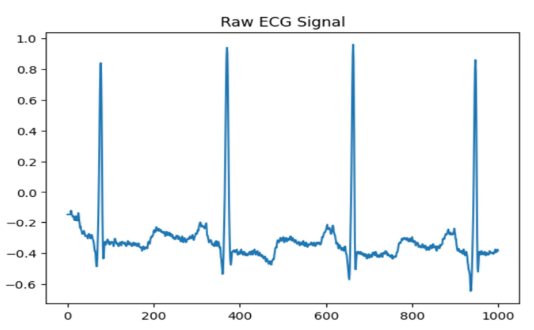
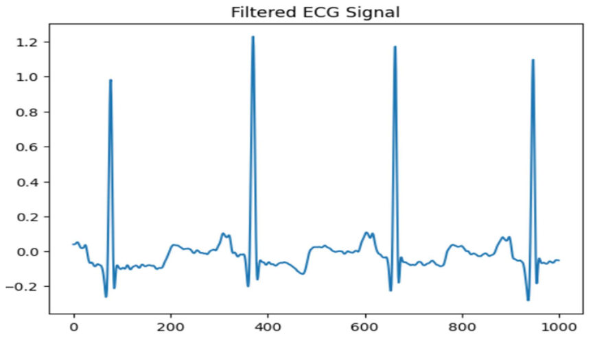
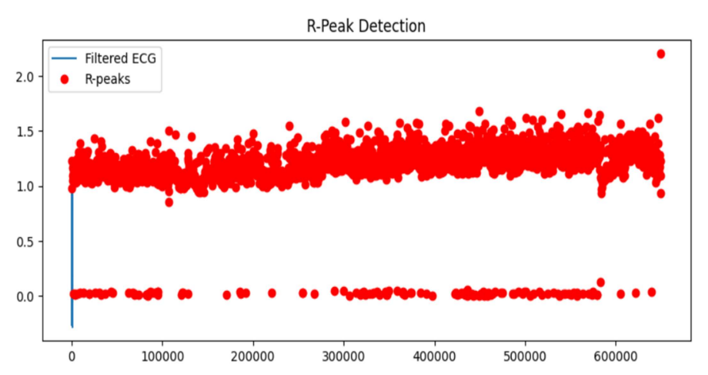
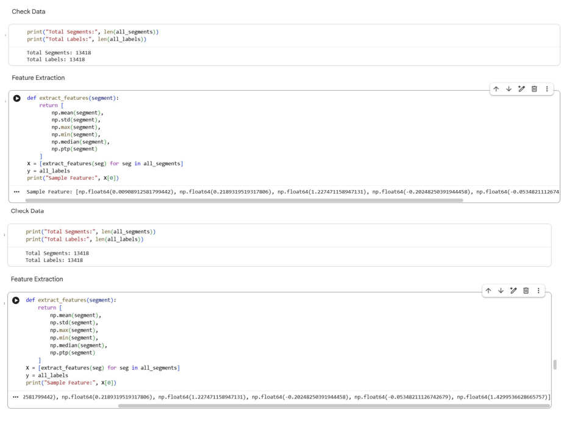
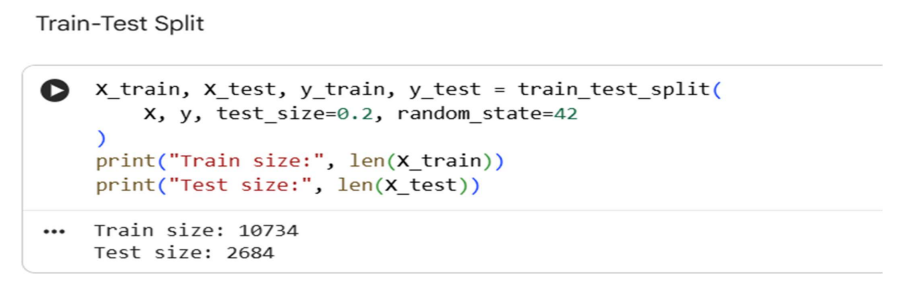
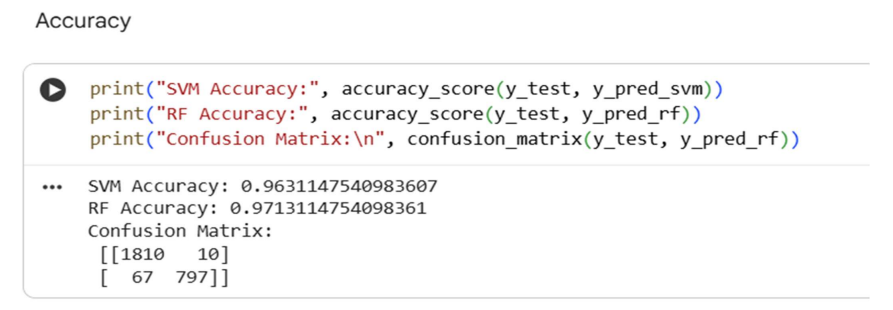
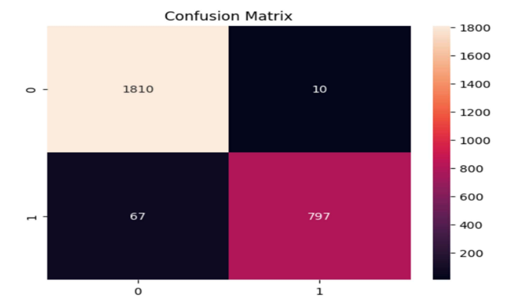
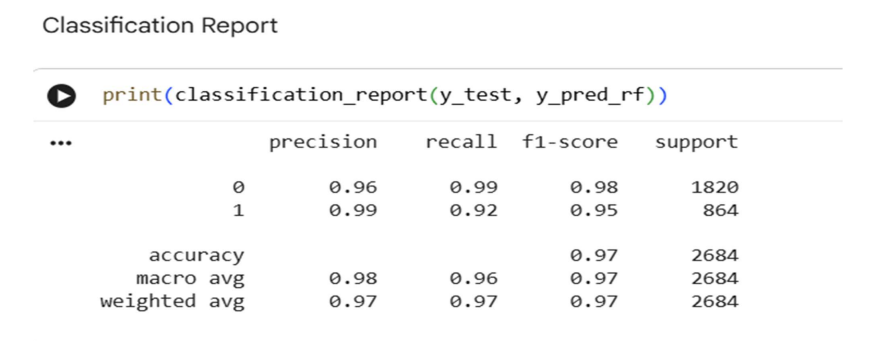
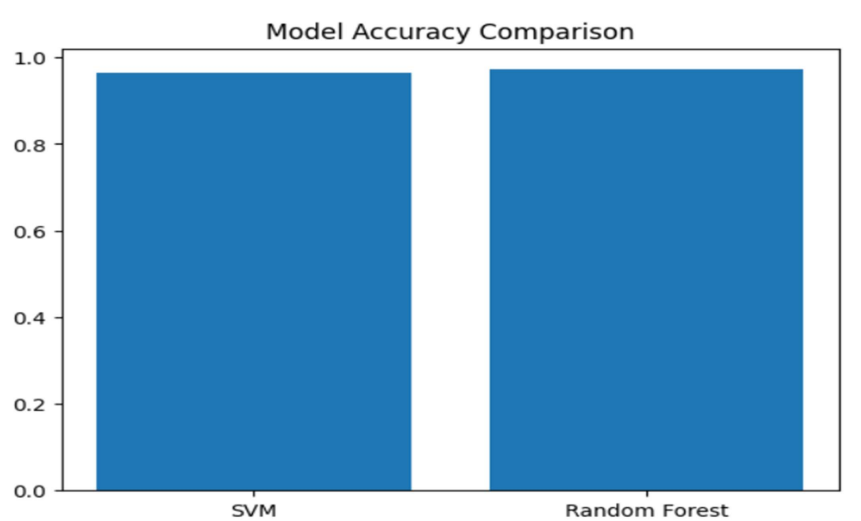
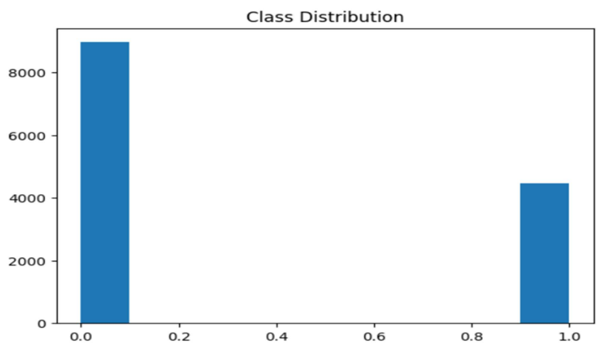

# ECG Signal Processing and Arrhythmia Detection Using Machine Learning

## Overview

This project presents an automated ECG Signal Processing and Arrhythmia Detection system using Machine Learning techniques. The system analyzes Electrocardiogram (ECG) signals, removes noise through digital signal processing, extracts meaningful cardiac features, and classifies heart rhythms into normal and abnormal categories using supervised machine learning algorithms.

The project combines Digital Signal Processing (DSP) with Machine Learning to improve the accuracy and efficiency of automated ECG analysis, providing a scalable solution for intelligent healthcare applications.

---

## Problem Statement

Manual interpretation of ECG signals is time-consuming, requires medical expertise, and is prone to human error. ECG recordings are also affected by various types of noise, such as baseline wander and power-line interference, which can reduce diagnostic accuracy.

This project aims to automate ECG signal analysis by preprocessing ECG recordings, extracting significant features, and applying machine learning algorithms for accurate arrhythmia detection.

---

## Objectives

- Study the characteristics of ECG signals and cardiac waveforms.
- Acquire ECG data from the MIT-BIH Arrhythmia Database.
- Remove noise using digital signal processing techniques.
- Detect R-peaks and calculate RR intervals.
- Extract time-domain, statistical, and morphological features.
- Train machine learning models for arrhythmia classification.
- Compare the performance of different classification algorithms.
- Evaluate the models using standard performance metrics.

---

## Dataset

**MIT-BIH Arrhythmia Database**

The project uses the MIT-BIH Arrhythmia Database, a benchmark dataset containing annotated ECG recordings widely used for arrhythmia detection research.

---

## Technologies Used

- Python
- Google Colab
- NumPy
- Pandas
- SciPy
- Scikit-learn
- Matplotlib
- WFDB

---

## Machine Learning Models

The following supervised machine learning algorithms were implemented:

- Support Vector Machine (SVM)
- Random Forest

---

## Project Workflow

```text
MIT-BIH ECG Dataset
          │
          ▼
Data Acquisition
          │
          ▼
Signal Preprocessing
(Bandpass Filtering & Normalization)
          │
          ▼
R-Peak Detection
          │
          ▼
Feature Extraction
          │
          ▼
Feature Selection & Scaling
          │
          ▼
Machine Learning Models
(SVM & Random Forest)
          │
          ▼
Performance Evaluation
          │
          ▼
Arrhythmia Classification
```

---

## Features Extracted

- RR Interval
- Heart Rate
- Mean
- Variance
- QRS Width
- Signal Amplitude
- Frequency-domain Features

---

## Performance Evaluation

The models were evaluated using:

- Accuracy
- Precision
- Recall
- F1-Score
- Confusion Matrix

---

## Results

The proposed system successfully preprocesses ECG signals, detects R-peaks, extracts relevant features, and classifies ECG signals into normal and abnormal categories.

Support Vector Machine (SVM) and Random Forest demonstrated reliable performance for automated ECG classification, highlighting the effectiveness of combining signal processing with machine learning techniques.

---

## Output Visualizations

### Raw ECG Signal



---

### Filtered ECG Signal



---

### R-Peak Detection



---

### Feature Extraction



---

### Train-Test Split



---

### SVM vs Random Forest Accuracy



---

### Confusion Matrix



---

### Classification Report



---

### Model Accuracy Comparison



---

### Class Distribution



---

## Applications

- Automated Arrhythmia Detection
- Clinical Decision Support Systems
- Smart Healthcare Solutions
- Wearable ECG Monitoring Devices
- Remote Patient Monitoring
- Telemedicine

---

## Future Scope

- Multi-class arrhythmia classification
- Deep Learning models (CNN, LSTM)
- Real-time ECG monitoring
- IoT-enabled healthcare devices
- Cloud-based healthcare systems
- Integration with wearable health monitoring devices

---

## Repository Contents

- README.md
- Project_Report.pdf
- ECG_Arrhythmia_Detection.ipynb
- Python source code
- ECG result images
- requirements.txt

---

## Installation

Clone the repository:

```bash
git clone https://github.com/your-username/ECG-Signal-Processing-and-Arrhythmia-Detection-Using-Machine-Learning.git
```

Install the required libraries:

```bash
pip install -r requirements.txt
```

---

## Running the Project

1. Clone or download this repository.
2. Open **ECG_Arrhythmia_Detection.ipynb** in Google Colab.
3. Install the required libraries if prompted.
4. Run the notebook cells sequentially.
5. View the generated evaluation metrics and visualizations.

---

## Author

**Sarthak Gupta**

B.Tech in Electronics & Communication Engineering

Jaypee Institute of Information Technology, Noida

